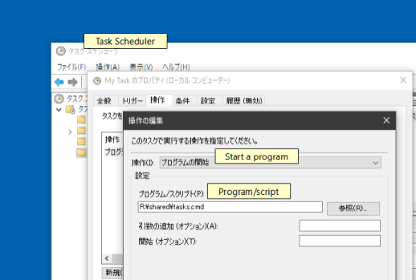
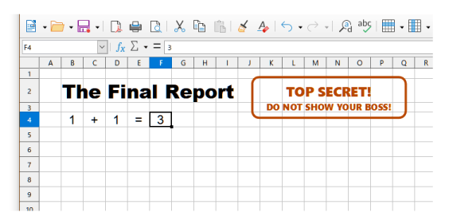
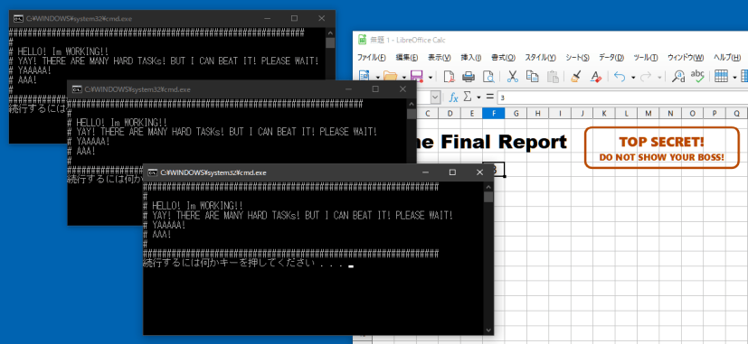
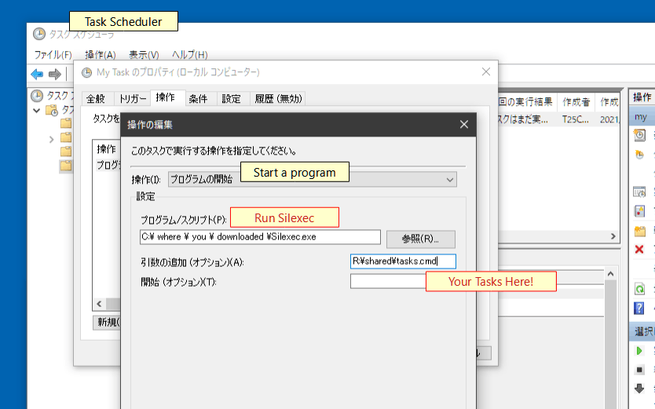

# Silexec
Executes a specified console app, PowerShell script, `.bat` or `.cmd` file without opening a window.

## Feature

Small footprint! The `.exe` file size is now only 4.5 kbytes!

## Download

- [64bit Windows 7, 8, 8.1, 10 (and 11...?)](https://github.com/tkuri2010/Silexec/releases/tag/v1.0.0)

## Supported Platforms

- (Windows 2000, XP, Vista, Windows Servers ... I don't have tested.)
- Windows 7 64bit
- Windows 8/8.1 64bit (I don't have tested yet, but it works fine I believe.)
- Windows 10 64bit
- (Windows 11, I believe so :)

### Where is the 32bit version?

These source codes are very very simple. So you can build it easily if you need it.

## Usage

### examples:

Using Command Prompt:
```cmd
C:\> Silexec C:\path\to\your_console_app.exe param param param
```

Using PowerShell:
```ps
PS> Silexec C:\path\to\your_console_app.exe param param param
```

## When do we use this?

### A Common Probrem:

You have some tasks you want execute **on background**.

```bat
@REM  tasks.cmd
@ECHO OFF

ECHO ##############################################################
ECHO #
ECHO # HELLO! Im WORKING!!
ECHO # YAY! THERE ARE MANY HARD TASKs! BUT I CAN BEAT IT! PLEASE WAIT!
ECHO # YAAAAA!
ECHO # AAA!
ECHO #
ECHO ##############################################################
TIMEOUT 5

ECHO "Im done." >> c:\a\result.txt
```

Using Windows Task Scheduler...



Then you go about your works...



When the scheduled tasks invoked...



**NOOO! DON'T DISTURB MEee!**

### Solve:

Use **Silexec** !



## How To Build?

1. Get Visual Studio 2019. The Community Edition is nice choice.
2. Open `"Silexec.sln"` with it.
3. Build.

